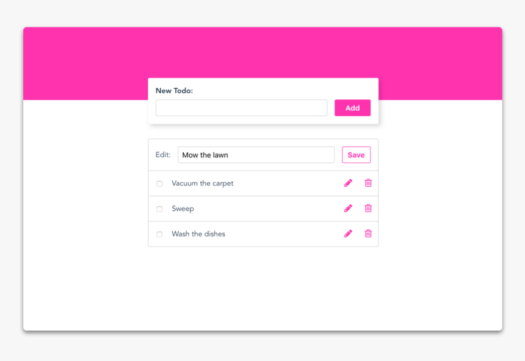

# C# interview

Vous allez devoir réaliser à l'identique cette maquette en HTML/CSS avec un backend simple en C#.

Voici quelques conseils pour y parvenir ainsi que les attentes :

1. Vous pouvez utiliser des frameworks CSS (comme Tailwind, Bootstrap, etc.) ou frameworks JavaScript (comme Angular, Vue.JS, React.JS, etc.)

2. Il faudra un backend en C# sans base de données (les données seront stockées dans des variables)

Bonus :

- Le front-end est responsive.

- Le code C# est simple, concis et efficace.

- Remplacer le header (fond rose) par une image.
